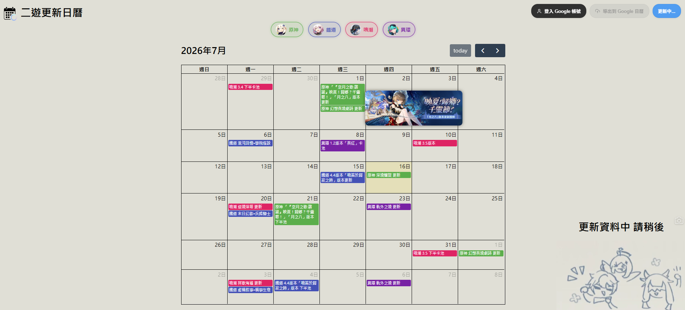

# 二遊更新日曆 (hoyoCalendar)

一個專為二次元熱門手遊打造的活動更新日曆工具。
本專案透過自動化爬蟲技術即時抓取各大官網公告，並提供直觀的日曆看板，支援將感興趣的遊戲日程 **一鍵同步（或批次刪除）** 至你的 Google 日曆，讓你不再錯過任何版本更新、前瞻直播或角色卡池！

---

## 線上 Demo

**[https://hoyo-calendar.vercel.app](https://hoyo-calendar.vercel.app)**
*(備用 Vercel 網域：https://hoyo-calendar-m30sch9f2-partner0487s-projects.vercel.app)*

---

## 實際運行畫面

*(圖中展示了自動分類的日曆事件色塊、已登入的 Google 帳號狀態，以及將滑鼠移至事件上時自動呈現的新聞 Webp 電腦版大圖預覽。)*

---

## 核心特色與功能

- **多款二遊日程一體化看板**：完美支援 **《原神》**、**《崩壞：星穹鐵道》**、**《鳴潮》** 以及 **《異環》** 日程。
- **動態過濾篩選**：頂部設有遊戲 ICON 篩選列，可自由勾選想關注的遊戲，日曆畫面將即時響應。
- **新聞大圖懸浮預覽**：滑鼠移至日曆事件上時，會自動浮現精緻的電腦版大圖，快速掌握公告重點。
- **Google Calendar 一鍵同步**：
  - 整合 Google OAuth 2.0 (GIS) 授權安全登入。
  - 專屬色彩同步（原神 - 綠、鐵道 - 藍、鳴潮 - 粉、異環 - 紫）。
  - **自動防重複機制**：重複匯出時會自動識別並更新事件，不塞爆你的個人日曆。
  - **無痕一鍵還原**：提供「刪除 Google 日曆所有事件」功能，安全清除所有由本網站建立的活動。
- **響應式載入動畫**：背景資料更新時，會貼心播放加載小動畫，給予使用者最優雅的等待體驗。

---

## 技術架構與棧 (Tech Stack)

### 前端 (Frontend)
- **HTML5 & CSS3**：自訂按鈕樣式與Glassmorphism UI。
- **Vanilla JavaScript (ES6 Modules)**：模組化結構，避免全域變數污染。
- **FullCalendar.js (v6)**：高度自訂化的網格日曆核心渲染。
- **Google APIs (GAPI & Google Identity Services - GIS)**：最新標準的安全第三方登入與 Google Calendar API V3 互動。

### 後端與自動化 (Backend & Automation)
- **Python (BeautifulSoup4 & Requests)**：精確解析並爬取遊戲官網之最新公告與 `<picture>` 電腦版 `srcset` 大圖。
- **Vercel Serverless Functions**：透過 `/api/update` 無伺服器函數處理輕量化資料串接。
- **LocalStorage Fallback**：前端具備本地快取防禦機制，若 API 請求失敗，將自動調用本地資料，保障離線可用性。

---

## 隱私權政策與資安說明

本專案極度重視使用者隱私與資安規範：
1. **最小權限原則**：本網站僅申請 `calendar.events` 與基礎 email 權限，僅用於在你的 Google 日曆中新增或刪除本程式建立的日程。
2. **零個人資料收集**：本網站為全靜態託管於 Vercel，**絕不**在後端資料庫記錄、儲存使用者的任何 Google 帳號金鑰、Email 或個人資訊。
3. **點擊劫持防禦**：設有 `X-Frame-Options: DENY` 安全頭部標籤，防止釣魚網站惡意嵌入。
4. **XSS 安全防護**：前端懸浮窗圖片路徑經過標準 DOM 屬性構建，不使用未過濾的 `innerHTML`，100% 阻斷惡意程式碼注入。

詳細資訊請參閱 [隱私權政策說明頁面](https://hoyo-calendar.vercel.app/Privacy.html)。

---

## 貢獻與反饋

非常歡迎社群的夥伴提交 Issue 或者是 Pull Request 來一起優化這個專案！無論是新增支援的遊戲爬蟲、介面美化，或是代碼重構，都期待你的參與！

- **開發人員**：夥伴 (partner0487)
- **電子郵件**：[partner0487@gmail.com](mailto:partner0487@gmail.com)
- **GitHub 專頁**：[@partner0487](https://github.com/partner0487)

---

## 📄 授權條款

此專案採用 **[MIT 授權條款](LICENSE)** 進行開源，歡迎自由使用、學習與修改。